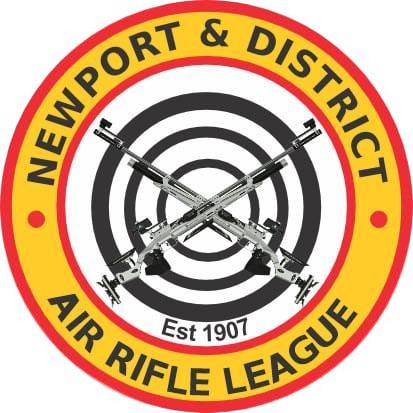

<div align="center">

  

  # NADARL Portal

  ### Newport & District Air Rifle League

  Official website and management portal for the Newport & District Air Rifle League — a competitive bell-target air rifle league where five teams shoot 7-yard matches on Monday evenings throughout the season.

  [](#)
  [](https://www.facebook.com/NADARL/)
  [](https://www.instagram.com/nadarl.1907/)
  [](#license)

</div>

---

## About

The NADARL Portal is a lightweight, dependency-free web app that lets members, team captains, and league administrators view fixtures, league tables, team rosters, match scorecards, rules, history, and gallery — all backed by a [Supabase](https://supabase.com) database.

Matches are shot with `.177` calibre air rifles using open dioptre sights at a painted metal bell target at **7 yards**. A clean bull scores **10 points**, graduating down to **0**.

## Features

| Area | Description |
| --- | --- |
| 🎯 **Fixtures** | Season schedule of home/away matches, byes, and no-match Mondays |
| 📊 **League Table** | Live standings, handicap standings, and individual averages |
| 👥 **Teams** | Team pages with rosters and season stats, captain / secretary / treasurer roles |
| 🏹 **Shooter Pages** | Per-shooter season results, history, and stat comparisons |
| 📇 **Match Scorecards** | Full 7-shot breakdowns for every shooter in every match, with live multi-user editing |
| 🏆 **Competitions & Events** | Standalone competitions and events, with PDF results |
| 🥇 **Trophies** | Roll of honour of league trophy winners |
| ☀️ **Summer League** | Seasonal summer league standings and PDF newsletters |
| 📜 **Rules** | League regulations, PDF-driven |
| 🏛️ **History & Committee** | League heritage timeline and committee member listing |
| 📸 **Gallery** | Photos from matches and events |
| 🛒 **Sales** | Member-to-member items for sale, with enquiry links |


## Tech Stack

- **Frontend** — Plain HTML, CSS, and vanilla JavaScript (no build step)
- **Backend / Database** — [Supabase](https://supabase.com) (Postgres + Auth + PostgREST API)
- **Hosting** — Static files; deployed via GitHub Pages, or self-hosted with git-pull (see [Deployment](#deployment))

## Project Structure

```
NADARL-Portal/
├── index.html              # Landing page with quick links
├── styles.css              # Shared global styles
├── HTML/                   # Page views
│   ├── fixtures.html       # Season fixtures
│   ├── table.html          # League table (standings, handicap, averages)
│   ├── teams.html          # All teams
│   ├── team.html           # Single team detail
│   ├── shooter.html        # Shooter results/history
│   ├── match.html          # Individual match scorecard
│   ├── competition.html    # Competition results
│   ├── event.html          # Single event detail
│   ├── trophies.html       # Trophy roll of honour
│   ├── summer-league.html  # Summer league standings & newsletters
│   ├── rules.html          # League rules (PDF-driven)
│   ├── history.html        # League history
│   ├── committee.html      # Committee members
│   ├── gallery.html        # Photo gallery
│   ├── sales.html          # Member sales items
│   ├── join.html           # Join / enquiries form
│   ├── login.html          # Sign in
│   ├── admin.html          # Admin hub: handicap formula, rules PDF, backup/restore
│   ├── admin-season-manager.html  # Admin: seasons, matches, competitions, events, exceptions
│   ├── admin-team-manager.html    # Admin: accounts/captains, teams
│   └── ...
├── CSS/                    # Per-page stylesheets
├── JS/                     # Application logic (vanilla JS)
│   ├── supabase-config.js  # Shared Supabase client (window.db)
│   ├── data.js             # Data-access helpers
│   ├── admin-common.js     # Shared admin helpers
│   ├── admin-*.js          # Per-tab admin logic (fixtures, teams, handicap, events, competitions, exceptions, rules, backup)
│   ├── fixtures.js         # Fixtures page logic
│   └── ...
├── Images/                 # Logos & imagery
├── deploy/                 # Self-hosting deploy script & nginx config (see Deployment)
└── supabase/               # Database schema, seed data & migrations
    ├── schema.sql          # Tables, views, RLS policies
    ├── seed.sql            # Sample season, teams & shooters
    └── migrations/         # Incremental schema changes
```

## Getting Started

### 1. Clone the repo

```bash
git clone https://github.com/GameBoyCymru/NADARL-Portal.git
cd NADARL-Portal
```

### 2. Configure Supabase keys

Copy the example keys file and fill in your project credentials:

```bash
cp JS/supabase-keys.example.js JS/supabase-keys.js
```

```js
// JS/supabase-keys.js
window.NADARL_SUPABASE_URL      = "https://YOUR-PROJECT.supabase.co";
window.NADARL_SUPABASE_ANON_KEY = "YOUR-ANON-PUBLIC-KEY";
```

> `supabase-keys.js` is git-ignored so your real credentials never enter version control.

### 3. Provision the database

Run the SQL in the **Supabase SQL Editor** (Dashboard → SQL → New query), in order:

1. `supabase/schema.sql` — tables, views, indexes, and Row Level Security policies
2. `supabase/migrations/*.sql` — incremental changes (captains, shooter numbers, exclusions, etc.)
3. `supabase/seed.sql` — optional sample data

### 4. Serve locally

No build step required. Just open `index.html`, or run a quick local server:

```bash
python3 -m http.server 8000
```

Then visit **http://localhost:8000**.

## Deployment

### GitHub Pages (default)

Pushes to `main` are automatically built and deployed to GitHub Pages by
[`.github/workflows/static.yml`](.github/workflows/static.yml) — no action needed beyond pushing.

### Self-hosting on Ubuntu (git-pull)

You can also serve the portal from your own server, keeping GitHub as the
source of truth: push to `main` as usual, and the server polls for new
commits and updates itself every few minutes. No webhook or inbound port is
required. The repo is public, so the server needs no credentials to pull it,
and `JS/supabase-keys.js` is already committed, so a plain `git pull` brings
everything needed to serve the site.

**1. Install packages**

```bash
sudo apt update
sudo apt install -y nginx git
```

**2. Clone the site**

```bash
sudo mkdir -p /var/www/nadarl-portal
sudo chown $USER:$USER /var/www/nadarl-portal
git clone https://github.com/GameBoyCymru/NADARL-Portal.git /var/www/nadarl-portal
```

**3. Configure nginx**

```bash
sudo cp /var/www/nadarl-portal/deploy/nadarl-portal.nginx.conf /etc/nginx/sites-available/nadarl-portal
sudo ln -s /etc/nginx/sites-available/nadarl-portal /etc/nginx/sites-enabled/nadarl-portal
sudo rm -f /etc/nginx/sites-enabled/default   # optional: remove the default nginx welcome page
```

If you have a domain pointed at the server, edit
`/etc/nginx/sites-available/nadarl-portal` and replace `server_name _;` with
`server_name yourdomain.com;`. Then test and reload:

```bash
sudo nginx -t
sudo systemctl reload nginx
```

Visit `http://<server-ip>/` — you should see the portal.

**4. Enable the deploy script**

```bash
chmod +x /var/www/nadarl-portal/deploy/deploy.sh
```

[`deploy/deploy.sh`](deploy/deploy.sh) fetches `origin/main`; if there's a
new commit it hard-resets the working tree to match it and logs the
deployed SHA, otherwise it exits quietly. It always resets rather than
merges, since this directory is deploy-only and should never diverge from
`main`. Run it once by hand to confirm it works:

```bash
/var/www/nadarl-portal/deploy/deploy.sh
git -C /var/www/nadarl-portal log -1 --oneline
```

**5. Schedule it with cron**

```bash
crontab -e
```

```
*/5 * * * * /var/www/nadarl-portal/deploy/deploy.sh >> /var/log/nadarl-deploy.log 2>&1
```

```bash
sudo touch /var/log/nadarl-deploy.log
sudo chown $USER:$USER /var/log/nadarl-deploy.log
```

**6. Test the full loop**

Push a small change to `main`, wait up to 5 minutes, then confirm
`git -C /var/www/nadarl-portal log -1` shows the new commit and the site
reflects it in a browser. `/var/log/nadarl-deploy.log` should log one line
per actual deploy and stay silent on no-op ticks.

**7. Optional hardening**

- **Firewall**: `sudo ufw allow 'Nginx Full'` and enable `ufw` with a default-deny inbound policy.
- **HTTPS**: once a domain points at the server, run `sudo apt install -y certbot python3-certbot-nginx` then `sudo certbot --nginx -d yourdomain.com`.
- **Slower polling**: once confident it's working, widen the cron interval (e.g. `*/10`) to reduce log noise.

## Data Model

```
season ─┬─ match ──┬─ score ── shooter
        │          └─ team
        └─ exclusion
team ──── shooter
user_profile (auth.users → role + team)
```

## Backup & Disaster Recovery

Admins can download a full data snapshot (seasons, teams, shooters, fixtures,
scores) at any time from **Admin → Data Backup & Restore** — no tooling
required. For full Postgres-level disaster recovery (schema, functions, RLS
policies, and data in one shot via `pg_dump`/`pg_restore`), see
[`supabase/BACKUP_RESTORE.md`](supabase/BACKUP_RESTORE.md).

## Contributing

Pull requests are welcome. For major changes, please open an issue first to discuss what you'd like to change.

## License

This project is licensed under the **MIT License**.

---

<div align="center">

&copy; Newport & District Air Rifle League

[🌐 Facebook](https://www.facebook.com/NADARL/) · [📸 Instagram](https://www.instagram.com/nadarl.1907/)

</div>
